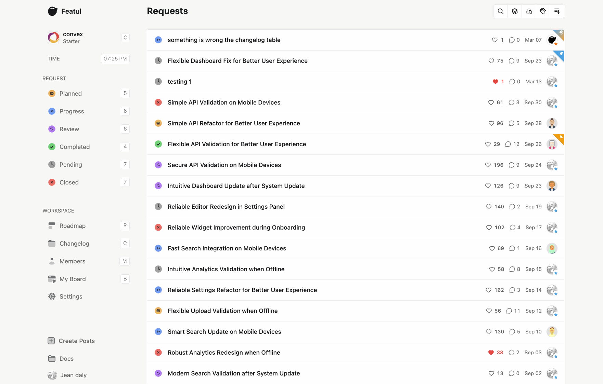
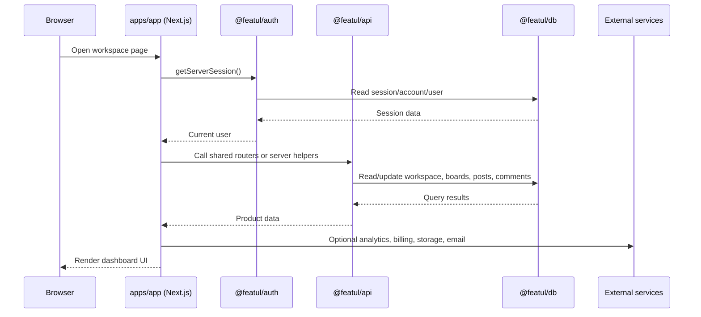
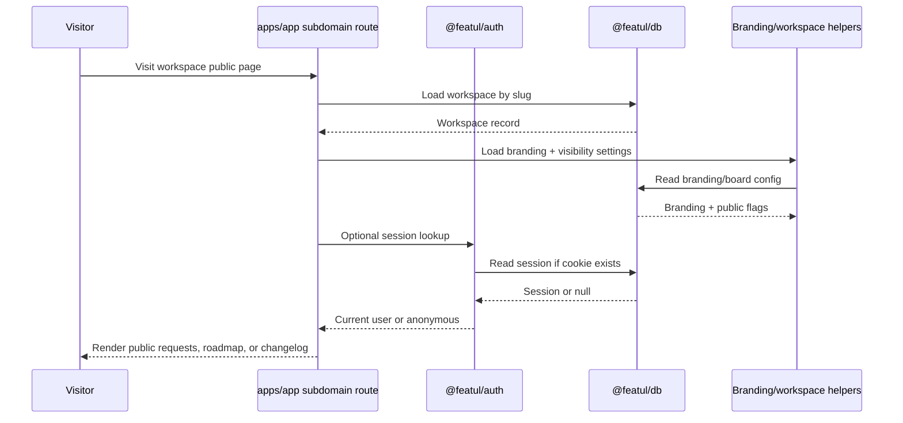
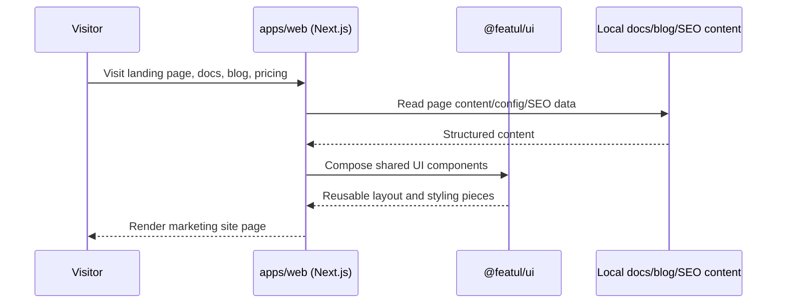

# Featul

<p align="center">
  
</p>

Featul is a privacy-first customer feedback platform for collecting requests, organising product decisions, publishing a public roadmap, and sharing changelog updates in one place. This repository contains the full Featul monorepo: the main product app, the marketing and documentation site, and the shared packages that power both.

<p align="center">
  
</p>

## What Featul Includes

- Feedback boards for collecting ideas, bugs, and feature requests
- Public roadmap and changelog pages that can be exposed on workspace subdomains
- Workspace, member, branding, and settings flows inside the main app
- Shared API, auth, database, editor, and UI packages used across the monorepo
- A separate marketing site with docs, blog, pricing, legal pages, and SEO content

## Codebase Overview

This repo is organised as a Turbo monorepo with two applications and several shared packages.

```text
.
├── apps/
│   ├── app/        # Main product app, dashboard, auth, workspace flows, widget, public boards
│   └── web/        # Marketing site, docs, blog, pricing, legal pages, static assets
├── packages/
│   ├── api/        # Shared routers, validators, services, and client utilities
│   ├── auth/       # Better Auth integration, billing hooks, session and workspace logic
│   ├── db/         # Drizzle schema, migrations, scripts, and database client
│   ├── editor/     # Shared editor package
│   ├── eslint-config/
│   ├── tsconfig/
│   └── ui/         # Shared UI components, icons, hooks, and styles
└── turbo.json      # Task orchestration for build, dev, lint, and type-checking
```

## Architecture At A Glance

The monorepo is split into two Next.js apps:

- `apps/app` is the main product runtime for signed-in users, workspace dashboards, feedback boards, roadmap, changelog, widget routes, and API endpoints.
- `apps/web` is the separate marketing and documentation site.
- Shared packages sit underneath both apps so auth, database access, API logic, editor features, and UI stay consistent.

```mermaid
flowchart LR
    U[User Browser]
    A[apps/app<br/>Next.js product app]
    W[apps/web<br/>Next.js marketing site]
    API[@featul/api<br/>shared API routers]
    AUTH[@featul/auth<br/>auth + billing]
    DB[@featul/db<br/>Drizzle + Postgres/Neon]
    UI[@featul/ui<br/>shared components]
    EDITOR[@featul/editor<br/>editor primitives]
    EXT[Stripe / Redis / PostHog / Sentry / storage]

    U --> A
    U --> W
    A --> API
    A --> AUTH
    A --> UI
    A --> EDITOR
    W --> UI
    API --> DB
    AUTH --> DB
    API --> EXT
    AUTH --> EXT
```

## Sequence Diagrams

These diagrams show the main ways the pieces work together.

### 1. Signed-in product flow

This is the normal dashboard flow inside `apps/app`, where a logged-in user opens a workspace page and the app reads session and workspace data.



### 2. Public board / roadmap / changelog flow

This is the public-facing workspace experience served by `apps/app` under subdomain-style routes.



### 3. Marketing and docs flow

The marketing site is a separate Next.js app with its own pages and content, but it still reuses shared UI patterns from the monorepo.



## Tech Stack

- Bun workspaces and Turborepo
- Next.js 16 and React 19
- TypeScript
- Tailwind CSS 4
- Drizzle ORM with Postgres/Neon
- Better Auth
- Stripe, Upstash, PostHog, Sentry, and other service integrations

## Setup

### Prerequisites

- Node.js 20 or newer
- Bun 1.2 or newer

### Install dependencies

```bash
bun install
```

### Configure environment variables

Create local env files for the two apps:

```bash
cp apps/app/.env.example apps/app/.env.local
cp apps/web/.env.example apps/web/.env.local
```

Then fill in the values you need.

- `apps/app/.env.local` covers the main app setup such as auth, database, Stripe, Redis, GitHub app integration, passkeys, and analytics.
- `apps/web/.env.local` covers the marketing site setup such as Marble CMS, site URLs, consent tooling, and analytics.

If you plan to run Drizzle database commands, make sure `DATABASE_URL` is also available to those scripts through your shell environment or a database env file that the DB package can read.

### Start development

Run the product app:

```bash
bun run app:dev
```

Run the marketing site:

```bash
bun run web:dev
```

Or start all development tasks from the repo root:

```bash
bun dev
```

When both Next.js apps are running locally, one of them may move to the next available port if `3000` is already in use.

## Useful Commands

```bash
bun dev
bun run app:dev
bun run web:dev
bun run lint
bun run check-types
bun run db:generate
bun run db:migrate
bun run db:push
bun run db:studio
```


## How The App Is Split

### `apps/app`

This is the signed-in product experience. It contains authentication flows, workspace management, request and board views, roadmap and changelog routes, reservation and invite flows, widget routes, and API endpoints used by the main app.

### `apps/web`

This is the public-facing web experience. It includes the landing page, docs, blog, pricing pages, legal content, integrations pages, use cases, alternatives pages, and a large set of SEO-driven business tools and definitions content.

### Shared packages

The shared packages keep product logic consistent across the repo. `@featul/api` centralises routers and services, `@featul/auth` holds auth and billing logic, `@featul/db` manages schema and migrations, `@featul/ui` provides reusable components and icons, and `@featul/editor` contains the editor building blocks used in the app.

## License

MIT. See [LICENSE](LICENSE).
